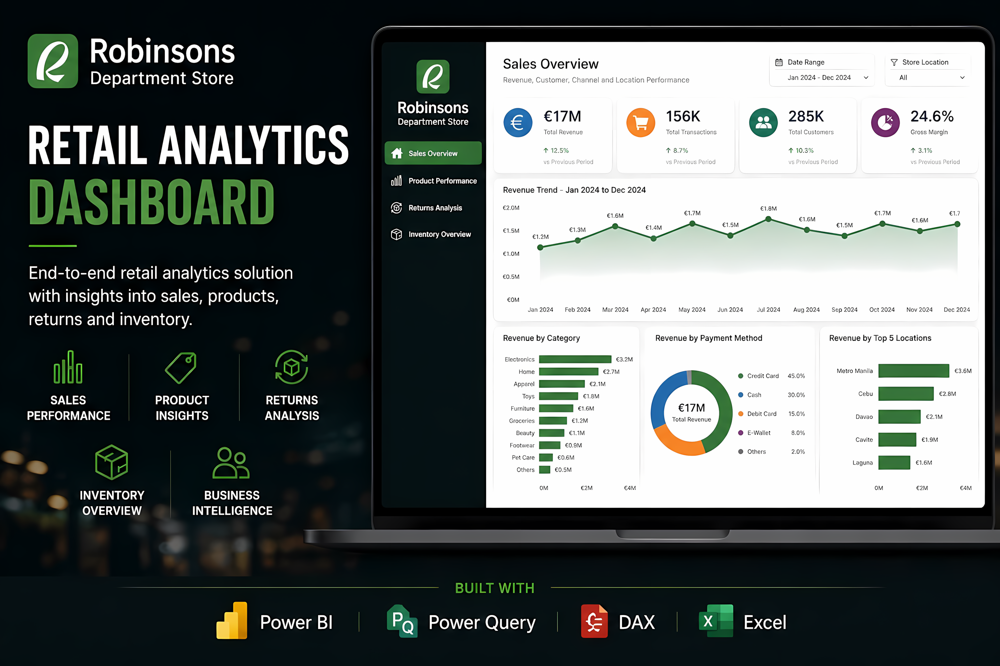

# Retail Analytics Project

## Overview

This project is an end-to-end retail analytics report built in Power BI.

The aim was to simulate a real business reporting environment for a department store, where management could track sales, product performance, returns and inventory from one report.

The report is built around practical business questions, such as:

- How is revenue trending over time?
- Which products and categories are driving performance?
- Which products are underperforming?
- Where are returns coming from?
- Which stock items are healthy, low, or at risk?

The project uses Power Query for data cleaning, a star schema model for analysis, DAX measures for KPIs, and Power BI report pages designed around business decision-making.

---

## Tools Used
- Power BI
- Power Query
- DAX
- Excel
- Photoshop

---

## Report Pages

### Sales Overview

The Sales Overview page gives a high-level view of business performance. It shows total revenue, orders, average order value and customer count, then breaks revenue down by category, sales channel and location.

The purpose of this page is to help management quickly see whether sales are trending up or down, which categories and channels are driving revenue, and where sales activity is concentrated geographically.

### Product Performance

The Product Performance page focuses on how individual products and categories are performing.

It highlights the top products by revenue, the lowest revenue products, category-level performance, and the relationship between revenue and order volume. This helps identify which products are driving sales, which products may need attention, and whether performance is being driven by volume, value, or both.

### Returns Analysis

The Returns Analysis page shows how returns are affecting the business.

It tracks returned units, return rate, return value and average days to return, then breaks returns down by category, channel and return reason. This helps identify where returns are concentrated and whether the issue is linked to product quality, customer behaviour, delivery problems or specific categories.

### Inventory Overview

The Inventory Overview page focuses on stock levels and inventory health.

It tracks total stock on hand, inventory value, low stock items and stock health percentage. The page also shows stock trends over time, current stock levels by product, and inventory value by category.

The purpose of this page is to help identify stock risk, low-stock products, and where the largest inventory value is held.

---

## Key Features
- Interactive report pages
- Power Query data cleaning and transformation
- Star schema data modelling
- DAX KPI measures
- Revenue, product, returns and inventory analysis
- Interactive slicers and filtering
- Business-focused reporting
- Professional dashboard design

---

## Author
Darragh Collins
